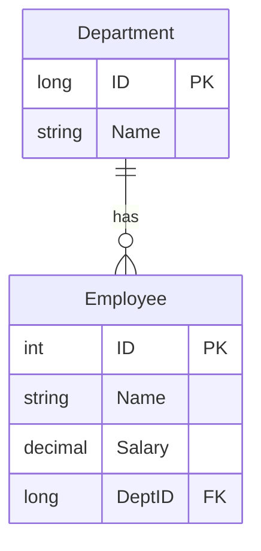
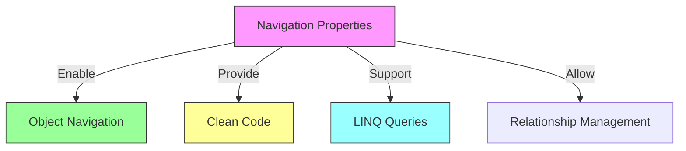
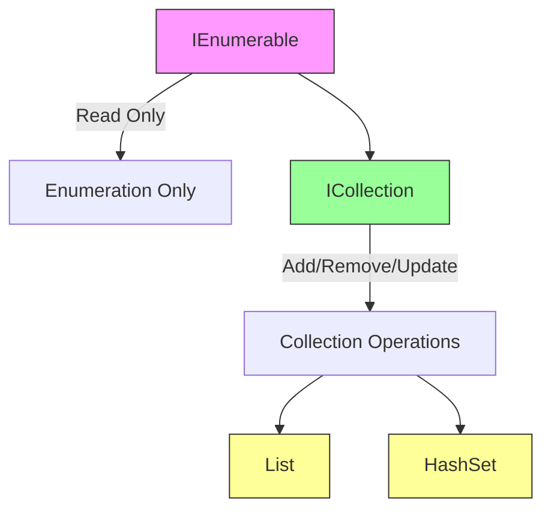
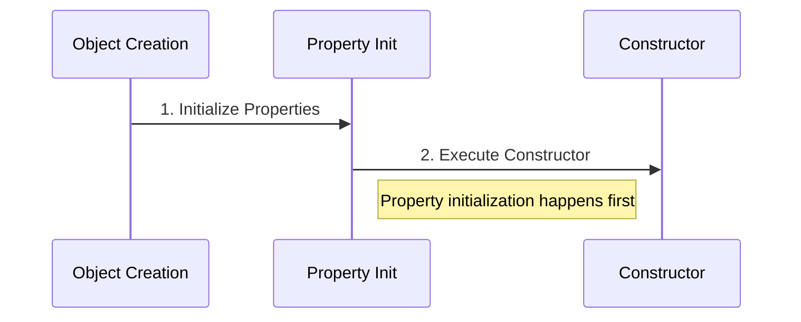

# Entity Framework Core Relationships and Navigation Properties

## Table of Contents
- [Introduction](#introduction)
- [Database vs Application Relationships](#database-vs-application-relationships)
- [Implementing Relationships](#implementing-relationships)
- [Navigation Properties](#navigation-properties)
- [Code Implementation](#code-implementation)

## Introduction

There's often a mismatch between how relationships are represented in databases versus object-oriented applications. Entity Framework Core bridges this gap through navigation properties.

## Database vs Application Relationships

### Database Relationships


### Types of Relationships
1. One-to-One (1:1)
2. One-to-Many (1:N)
3. Many-to-Many (M:N)

## Implementing Relationships

### Database Level


### Application Level
```csharp
public class Department
{
    public long ID { get; set; }
    public string Name { get; set; }
    
    // Navigation property
    public ICollection<Employee> Employees { get; set; }
}

public class Employee
{
    public int ID { get; set; }
    public string Name { get; set; }
    public decimal Salary { get; set; }
    
    // Foreign key property
    public long DeptID { get; set; }
    
    // Navigation property
    public Department Department { get; set; }
}
```

## Navigation Properties

### Characteristics
1. **Bidirectional Navigation**
   - Department → List of Employees
   - Employee → Associated Department

2. **No Database Representation**
   - Navigation properties exist only in code
   - EF Core handles the translation to foreign keys

### Benefits


## Code Implementation

### Department Class
```csharp
public class Department
{
    public long ID { get; set; }
    public string Name { get; set; }
    
    // Navigation property for one-to-many relationship
    public virtual ICollection<Employee> Employees { get; set; }
}
```

### Employee Class
```csharp
public class Employee
{
    public int ID { get; set; }
    public string Name { get; set; }
    public decimal Salary { get; set; }
    
    // Foreign key property
    public long DeptID { get; set; }
    
    // Navigation property to parent department
    public virtual Department Department { get; set; }
}
```

## Key Points

1. **Relationship Direction**
   - Database: One-directional (through foreign keys)
   - Application: Bidirectional (through navigation properties)

2. **EF Core's Role**
   - Translates navigation properties to appropriate database schemas
   - Manages relationship tracking and updates
   - Handles foreign key constraints

3. **Benefits of Navigation Properties**
   - More intuitive object model
   - Easier relationship traversal
   - Better code readability
   - Simplified LINQ queries

## Best Practices

1. **Navigation Property Naming**
   ```csharp
   // Single reference
   public Department Department { get; set; }
   
   // Collection
   public ICollection<Employee> Employees { get; set; }
   ```

2. **Foreign Key Convention**
   ```csharp
   // Follow naming convention
   public long DepartmentId { get; set; }  // FK property
   public Department Department { get; set; }  // Navigation property
   ```

## Notes
- Navigation properties exist only in code
- EF Core handles the database mapping
- Relationships can be configured further using Fluent API
- Consider lazy loading implications
- Virtual properties enable lazy loading


# Navigation Property Implementation in Entity Framework Core

## Table of Contents
- [Collection Type Selection](#collection-type-selection)
- [Property Initialization](#property-initialization)
- [Implementation Best Practices](#implementation-best-practices)
- [Migration Conventions](#migration-conventions)

## Collection Type Selection

### Interface Hierarchy


### Choosing the Right Interface

| Interface | Use Case | Capabilities |
|-----------|----------|--------------|
| `IEnumerable<T>` | Read-only scenarios | Enumeration only |
| `ICollection<T>` | Full CRUD operations | Add, Remove, Update |

## Property Initialization

### Initialization Approaches

1. **Constructor Initialization**
```csharp
public class Department
{
    public Department()
    {
        Employees = new HashSet<Employee>();
    }

    public ICollection<Employee> Employees { get; set; }
}
```

2. **Property Initialization**
```csharp
public class Department
{
    public ICollection<Employee> Employees { get; set; } = new HashSet<Employee>();
}
```

### Initialization Flow


## Implementation Best Practices

### 1. Interface-Based Design
```csharp
// ✅ Good: Programming to interface
public ICollection<Employee> Employees { get; set; }

// ❌ Avoid: Programming to concrete implementation
public List<Employee> Employees { get; set; }
```

### 2. Collection Type Selection
```csharp
public class Department
{
    // Prefer HashSet for unique collections
    public ICollection<Employee> Employees { get; set; } = new HashSet<Employee>();
}
```

### 3. Loose Coupling
```csharp
// Flexible design allows different implementations
public interface IEmployeeCollection : ICollection<Employee> 
{
    // Additional methods if needed
}

public class Department
{
    public ICollection<Employee> Employees { get; set; }
}
```

## Migration Conventions

### Foreign Key Generation
```csharp
public class Employee
{
    public int Id { get; set; }
    public Department Department { get; set; }
    // EF Core generates: DepartmentDeptId
}
```

### Convention-Based Naming
```mermaid
graph LR
    A[Entity Name] -->|[Step 1]| B[Primary Key Name]
    B -->|[Step 2]| C[Foreign Key Name]
    
    style A fill:#ff69b4,stroke:#333
    style B fill:#90ee90,stroke:#333
    style C fill:#ffffe0,stroke:#333
    
    %% Add labels below nodes
    classDef labelStyle font-size:12px
    class A,B,C labelStyle
    
    %% Add examples as notes
    note1[Example: Department]
    note2[Example: DeptId]
    note3[Example: DepartmentDeptId]
    
    A --> note1
    B --> note2
    C --> note3
    
    style note1 fill:#ff69b4,stroke:#333,stroke-dasharray: 5 5
    style note2 fill:#90ee90,stroke:#333,stroke-dasharray: 5 5
    style note3 fill:#ffffe0,stroke:#333,stroke-dasharray: 5 5
```

## Collection Initialization Examples

### HashSet Implementation
```csharp
public class Department
{
    // Property initialization
    public ICollection<Employee> Employees { get; set; } = new HashSet<Employee>();

    // Additional properties
    public int DeptId { get; set; }
    public string Name { get; set; }
}
```

### Benefits of HashSet
1. Ensures uniqueness
2. Better performance for large collections
3. Prevents duplicate entries

## Best Practices Summary

1. **Interface Usage**
   - Use `ICollection<T>` for CRUD operations
   - Use `IEnumerable<T>` for read-only scenarios

2. **Initialization**
   ```csharp
   // Prefer property initialization
   public ICollection<T> Collection { get; set; } = new HashSet<T>();
   ```

3. **Collection Type**
   - Use `HashSet<T>` for unique collections
   - Consider performance implications

4. **Naming Conventions**
   - Follow EF Core conventions for foreign keys
   - Be consistent with naming patterns

## Notes
- Property initialization occurs before constructor execution
- EF Core handles foreign key generation automatically
- Consider using HashSet for better performance
- Navigation properties should be interface-based
- Avoid tight coupling to specific collection types
