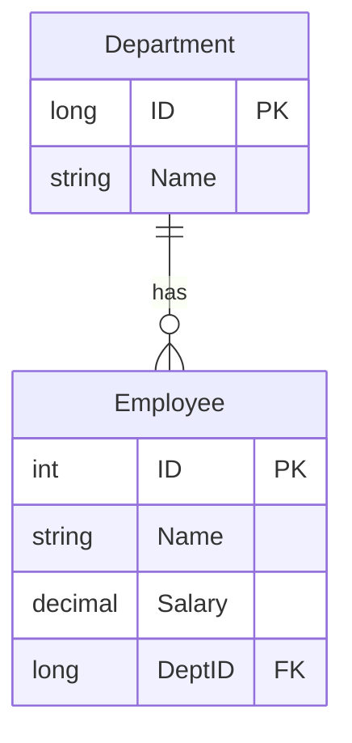
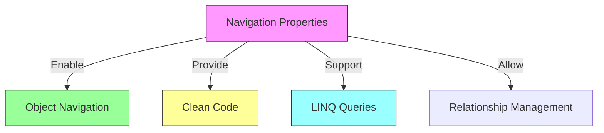
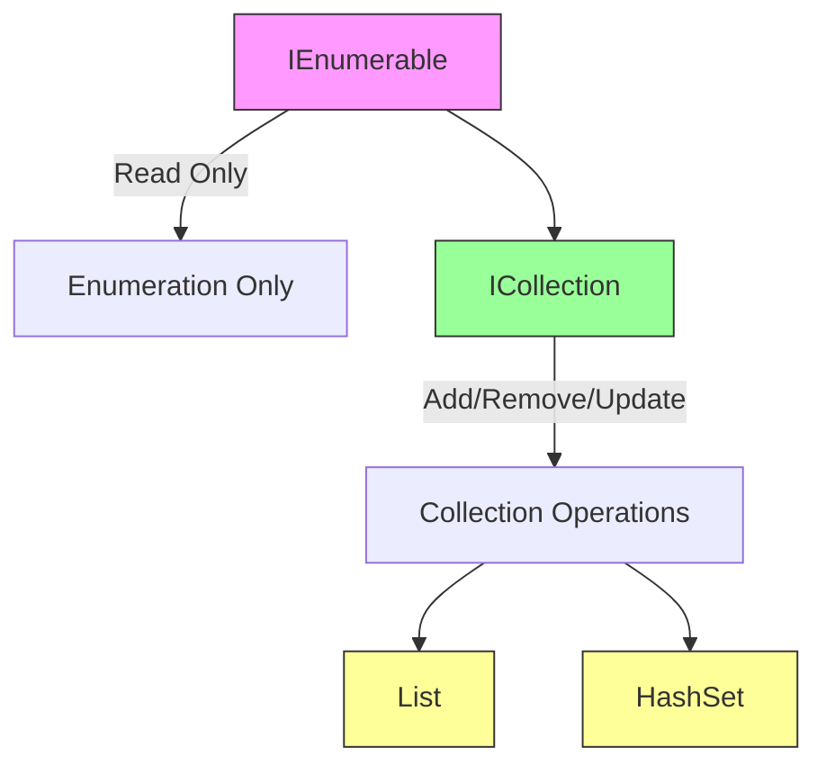
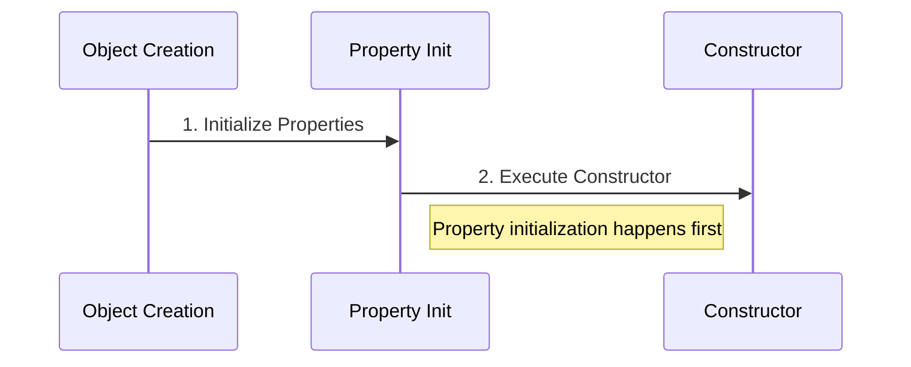
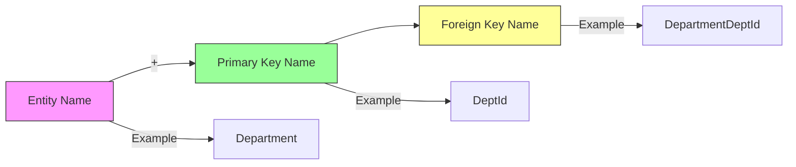
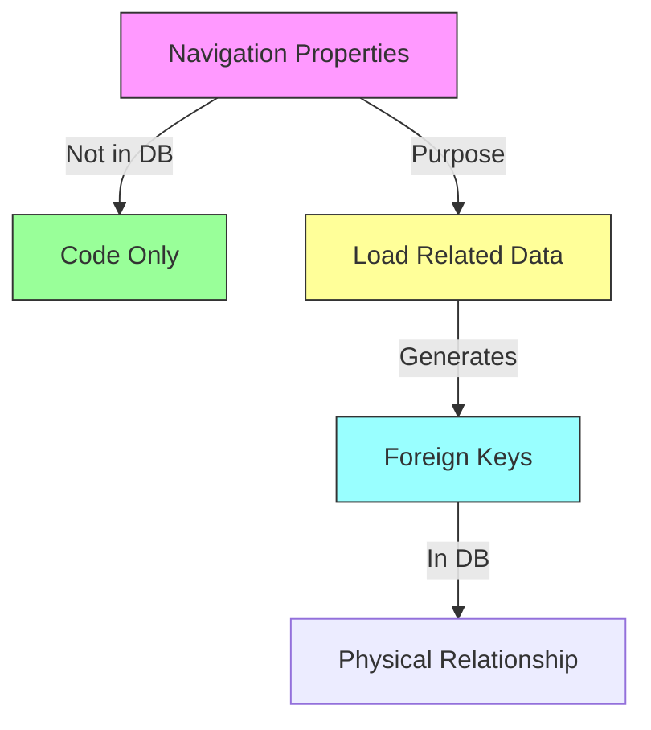
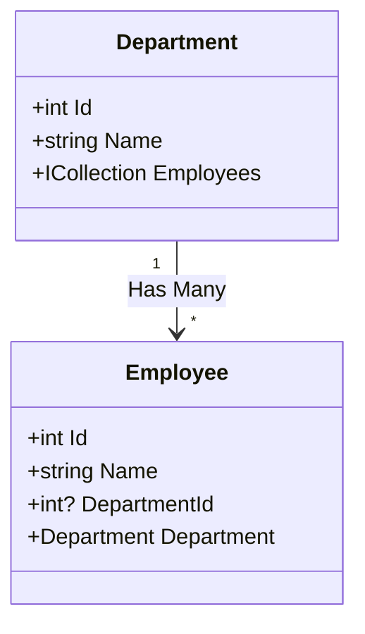

# Entity Framework Core Relationships and Navigation Properties

## Table of Contents
- [Introduction](#introduction)
- [Database vs Application Relationships](#database-vs-application-relationships)
- [Implementing Relationships](#implementing-relationships)
- [Navigation Properties](#navigation-properties)
- [Code Implementation](#code-implementation)

## Introduction

There's often a mismatch between how relationships are represented in databases versus object-oriented applications. Entity Framework Core bridges this gap through navigation properties.

## Database vs Application Relationships

### Database Relationships


### Types of Relationships
1. One-to-One (1:1)
2. One-to-Many (1:N)
3. Many-to-Many (M:N)

## Implementing Relationships

### Database Level


### Application Level
```csharp
public class Department
{
    public long ID { get; set; }
    public string Name { get; set; }
    
    // Navigation property
    public ICollection<Employee> Employees { get; set; }
}

public class Employee
{
    public int ID { get; set; }
    public string Name { get; set; }
    public decimal Salary { get; set; }
    
    // Foreign key property
    public long DeptID { get; set; }
    
    // Navigation property
    public Department Department { get; set; }
}
```

## Navigation Properties

### Characteristics
1. **Bidirectional Navigation**
   - Department → List of Employees
   - Employee → Associated Department

2. **No Database Representation**
   - Navigation properties exist only in code
   - EF Core handles the translation to foreign keys

### Benefits


## Code Implementation

### Department Class
```csharp
public class Department
{
    public long ID { get; set; }
    public string Name { get; set; }
    
    // Navigation property for one-to-many relationship
    public virtual ICollection<Employee> Employees { get; set; }
}
```

### Employee Class
```csharp
public class Employee
{
    public int ID { get; set; }
    public string Name { get; set; }
    public decimal Salary { get; set; }
    
    // Foreign key property
    public long DeptID { get; set; }
    
    // Navigation property to parent department
    public virtual Department Department { get; set; }
}
```

## Key Points

1. **Relationship Direction**
   - Database: One-directional (through foreign keys)
   - Application: Bidirectional (through navigation properties)

2. **EF Core's Role**
   - Translates navigation properties to appropriate database schemas
   - Manages relationship tracking and updates
   - Handles foreign key constraints

3. **Benefits of Navigation Properties**
   - More intuitive object model
   - Easier relationship traversal
   - Better code readability
   - Simplified LINQ queries

## Best Practices

1. **Navigation Property Naming**
   ```csharp
   // Single reference
   public Department Department { get; set; }
   
   // Collection
   public ICollection<Employee> Employees { get; set; }
   ```

2. **Foreign Key Convention**
   ```csharp
   // Follow naming convention
   public long DepartmentId { get; set; }  // FK property
   public Department Department { get; set; }  // Navigation property
   ```

## Notes
- Navigation properties exist only in code
- EF Core handles the database mapping
- Relationships can be configured further using Fluent API
- Consider lazy loading implications
- Virtual properties enable lazy loading


# Navigation Property Implementation in Entity Framework Core

## Table of Contents
- [Collection Type Selection](#collection-type-selection)
- [Property Initialization](#property-initialization)
- [Implementation Best Practices](#implementation-best-practices)
- [Migration Conventions](#migration-conventions)

## Collection Type Selection

### Interface Hierarchy


### Choosing the Right Interface

| Interface | Use Case | Capabilities |
|-----------|----------|--------------|
| `IEnumerable<T>` | Read-only scenarios | Enumeration only |
| `ICollection<T>` | Full CRUD operations | Add, Remove, Update |

## Property Initialization

### Initialization Approaches

1. **Constructor Initialization**
```csharp
public class Department
{
    public Department()
    {
        Employees = new HashSet<Employee>();
    }

    public ICollection<Employee> Employees { get; set; }
}
```

2. **Property Initialization**
```csharp
public class Department
{
    public ICollection<Employee> Employees { get; set; } = new HashSet<Employee>();
}
```

### Initialization Flow


## Implementation Best Practices

### 1. Interface-Based Design
```csharp
// ✅ Good: Programming to interface
public ICollection<Employee> Employees { get; set; }

// ❌ Avoid: Programming to concrete implementation
public List<Employee> Employees { get; set; }
```

### 2. Collection Type Selection
```csharp
public class Department
{
    // Prefer HashSet for unique collections
    public ICollection<Employee> Employees { get; set; } = new HashSet<Employee>();
}
```

### 3. Loose Coupling
```csharp
// Flexible design allows different implementations
public interface IEmployeeCollection : ICollection<Employee> 
{
    // Additional methods if needed
}

public class Department
{
    public ICollection<Employee> Employees { get; set; }
}
```

## Migration Conventions

### Foreign Key Generation
```csharp
public class Employee
{
    public int Id { get; set; }
    public Department Department { get; set; }
    // EF Core generates: DepartmentDeptId
}
```

### Convention-Based Naming


## Collection Initialization Examples

### HashSet Implementation
```csharp
public class Department
{
    // Property initialization
    public ICollection<Employee> Employees { get; set; } = new HashSet<Employee>();

    // Additional properties
    public int DeptId { get; set; }
    public string Name { get; set; }
}
```

### Benefits of HashSet
1. Ensures uniqueness
2. Better performance for large collections
3. Prevents duplicate entries

## Best Practices Summary

1. **Interface Usage**
   - Use `ICollection<T>` for CRUD operations
   - Use `IEnumerable<T>` for read-only scenarios

2. **Initialization**
   ```csharp
   // Prefer property initialization
   public ICollection<T> Collection { get; set; } = new HashSet<T>();
   ```

3. **Collection Type**
   - Use `HashSet<T>` for unique collections
   - Consider performance implications

4. **Naming Conventions**
   - Follow EF Core conventions for foreign keys
   - Be consistent with naming patterns

## Notes
- Property initialization occurs before constructor execution
- EF Core handles foreign key generation automatically
- Consider using HashSet for better performance
- Navigation properties should be interface-based
- Avoid tight coupling to specific collection types


# Advanced Relationships and Foreign Keys in EF Core

## Table of Contents
- [Multiple Relationships](#multiple-relationships)
- [Foreign Key Conventions](#foreign-key-conventions)
- [Navigation Property Patterns](#navigation-property-patterns)
- [Data Annotations](#data-annotations)
- [Best Practices](#best-practices)

## Multiple Relationships

### Handling Multiple Relationships Between Classes
```csharp
public class Employee
{
    public int Id { get; set; }
    
    [InverseProperty("CurrentEmployees")]
    public Department WorkDepartment { get; set; }
    
    [InverseProperty("FormerEmployees")]
    public Department PreviousDepartment { get; set; }
}

public class Department
{
    public int DeptId { get; set; }
    
    [InverseProperty("WorkDepartment")]
    public ICollection<Employee> CurrentEmployees { get; set; }
    
    [InverseProperty("PreviousDepartment")]
    public ICollection<Employee> FormerEmployees { get; set; }
}
```

## Foreign Key Conventions

### Default Convention


### Custom Foreign Key Naming
```csharp
public class Employee
{
    public int Id { get; set; }
    
    // Custom foreign key property name
    [ForeignKey("Department")]
    public int? DepartmentId { get; set; }
    
    public Department Department { get; set; }
}
```

## Navigation Property Patterns

### Relationship Types Based on Navigation Properties

| Configuration | Resulting Relationship |
|--------------|------------------------|
| Many-side only | One-to-Many |
| One-side only | One-to-One |
| Both sides | Based on property type |
| No navigation | One-to-One (default) |

### Examples
```csharp
// One-to-Many (minimal configuration)
public class Employee
{
    public Department Department { get; set; }  // Many side only
}

// One-to-One (minimal configuration)
public class Department
{
    public Employee Manager { get; set; }  // One side only
}
```

## Data Annotations

### Common Annotations

```csharp
public class Employee
{
    // Specify foreign key for navigation property
    [ForeignKey("DepartmentId")]
    public Department Department { get; set; }
    
    // Custom foreign key property name
    public int? DepartmentId { get; set; }
    
    // Multiple relationships
    [InverseProperty("CurrentEmployees")]
    public Department CurrentDepartment { get; set; }
}
```

### Annotation Usage Table

| Annotation | Purpose | Target |
|------------|---------|--------|
| `[ForeignKey]` | Specify FK property name | Navigation Property |
| `[InverseProperty]` | Define inverse relationship | Navigation Property |
| `[Required]` | Make FK non-nullable | Foreign Key Property |

## Best Practices

1. **Foreign Key Properties**
```csharp
public class Employee
{
    // Explicit FK property for better control
    public int? DepartmentId { get; set; }
    public Department Department { get; set; }
}
```

2. **Relationship Configuration**
```csharp
// Clear relationship definition
public class Department
{
    public int DeptId { get; set; }
    public string Name { get; set; }
    
    // Collection navigation property
    public ICollection<Employee> Employees { get; set; } 
        = new HashSet<Employee>();
}
```

3. **Multiple Relationships**
```csharp
// Use meaningful names for relationships
public class Employee
{
    [InverseProperty(nameof(Department.CurrentEmployees))]
    public Department CurrentDepartment { get; set; }
    
    [InverseProperty(nameof(Department.FormerEmployees))]
    public Department FormerDepartment { get; set; }
}
```

## Database Considerations



## Notes
- Navigation properties exist only in code
- EF Core generates appropriate foreign keys
- Default conventions can be overridden
- Consider nullability of foreign keys
- Use data annotations for explicit configuration
- Navigation properties facilitate related data loading


# One-to-Many Relationships in Entity Framework Core

## Overview
One-to-Many relationships in Entity Framework Core can be configured using three different approaches:
1. Convention-based configuration
2. Data Annotations
3. Fluent API configuration

This guide focuses on the Fluent API approach, which offers the most comprehensive configuration options.

## Relationship Configuration Using Fluent API

### Basic Configuration Patterns

There are several ways to configure one-to-many relationships using Fluent API:

```csharp
// Starting from Department entity
modelBuilder.Entity<Department>()
    .HasMany(d => d.Employees)
    .WithOne(e => e.Department);

// With optional navigation property
modelBuilder.Entity<Department>()
    .HasMany(d => d.Employees)
    .WithOne();

// Starting from Employee entity
modelBuilder.Entity<Employee>()
    .HasOne(e => e.Department)
    .WithMany(d => d.Employees);
```

> **Key Pattern**: Always start with `Has` and end with `With`

## Advanced Configuration Options

The Fluent API provides additional configuration capabilities beyond basic relationship mapping:

```csharp
modelBuilder.Entity<Department>()
    .HasMany(d => d.Employees)
    .WithOne()
    .IsRequired(false)
    .HasForeignKey(e => e.DepartmentId)
    .OnDelete(DeleteBehavior.Cascade);
```

### Delete Behaviors

| Behavior | Description |
|----------|-------------|
| `Cascade` | Automatically deletes related entities |
| `SetNull` | Sets foreign key to null in related entities |
| `Restrict` | Prevents deletion if related entities exist |

## Relationship Visualization



## Important Notes

1. **Migration Impact**: When modifying relationships:
   - EF Core drops the existing relationship
   - Creates new relationship with updated configuration
   - May require data handling for existing records

2. **Configuration Priority**:
   - Fluent API configurations override Data Annotations
   - Data Annotations override conventions
   - Use Fluent API when you need:
     - Complex relationship configuration
     - Delete behavior customization
     - Optional relationships
     - Custom foreign key names

3. **Best Practices**:
   - Configure relationships in `OnModelCreating`
   - Keep relationship configurations together for better maintainability
   - Document any custom delete behaviors
   - Consider impact on existing data when changing relationships

## Configuration Location Options

You can configure relationships in either:
1. `OnModelCreating` method in DbContext
2. Separate EntityTypeConfiguration classes

### Example Using EntityTypeConfiguration

```csharp
public class DepartmentConfiguration : IEntityTypeConfiguration<Department>
{
    public void Configure(EntityTypeBuilder<Department> builder)
    {
        builder
            .HasMany(d => d.Employees)
            .WithOne(e => e.Department)
            .HasForeignKey(e => e.DepartmentId)
            .OnDelete(DeleteBehavior.Cascade);
    }
}
```
