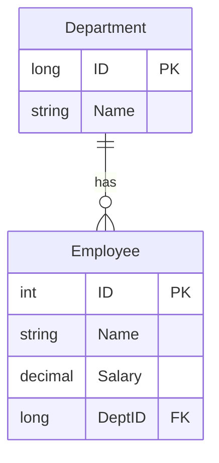
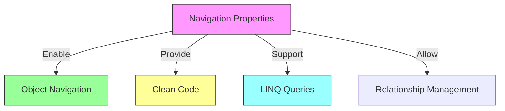

# Entity Framework Core Relationships and Navigation Properties

## Table of Contents
- [Introduction](#introduction)
- [Database vs Application Relationships](#database-vs-application-relationships)
- [Implementing Relationships](#implementing-relationships)
- [Navigation Properties](#navigation-properties)
- [Code Implementation](#code-implementation)

## Introduction

There's often a mismatch between how relationships are represented in databases versus object-oriented applications. Entity Framework Core bridges this gap through navigation properties.

## Database vs Application Relationships

### Database Relationships


### Types of Relationships
1. One-to-One (1:1)
2. One-to-Many (1:N)
3. Many-to-Many (M:N)

## Implementing Relationships

### Database Level


### Application Level
```csharp
public class Department
{
    public long ID { get; set; }
    public string Name { get; set; }
    
    // Navigation property
    public ICollection<Employee> Employees { get; set; }
}

public class Employee
{
    public int ID { get; set; }
    public string Name { get; set; }
    public decimal Salary { get; set; }
    
    // Foreign key property
    public long DeptID { get; set; }
    
    // Navigation property
    public Department Department { get; set; }
}
```

## Navigation Properties

### Characteristics
1. **Bidirectional Navigation**
   - Department → List of Employees
   - Employee → Associated Department

2. **No Database Representation**
   - Navigation properties exist only in code
   - EF Core handles the translation to foreign keys

### Benefits


## Code Implementation

### Department Class
```csharp
public class Department
{
    public long ID { get; set; }
    public string Name { get; set; }
    
    // Navigation property for one-to-many relationship
    public virtual ICollection<Employee> Employees { get; set; }
}
```

### Employee Class
```csharp
public class Employee
{
    public int ID { get; set; }
    public string Name { get; set; }
    public decimal Salary { get; set; }
    
    // Foreign key property
    public long DeptID { get; set; }
    
    // Navigation property to parent department
    public virtual Department Department { get; set; }
}
```

## Key Points

1. **Relationship Direction**
   - Database: One-directional (through foreign keys)
   - Application: Bidirectional (through navigation properties)

2. **EF Core's Role**
   - Translates navigation properties to appropriate database schemas
   - Manages relationship tracking and updates
   - Handles foreign key constraints

3. **Benefits of Navigation Properties**
   - More intuitive object model
   - Easier relationship traversal
   - Better code readability
   - Simplified LINQ queries

## Best Practices

1. **Navigation Property Naming**
   ```csharp
   // Single reference
   public Department Department { get; set; }
   
   // Collection
   public ICollection<Employee> Employees { get; set; }
   ```

2. **Foreign Key Convention**
   ```csharp
   // Follow naming convention
   public long DepartmentId { get; set; }  // FK property
   public Department Department { get; set; }  // Navigation property
   ```

## Notes
- Navigation properties exist only in code
- EF Core handles the database mapping
- Relationships can be configured further using Fluent API
- Consider lazy loading implications
- Virtual properties enable lazy loading
